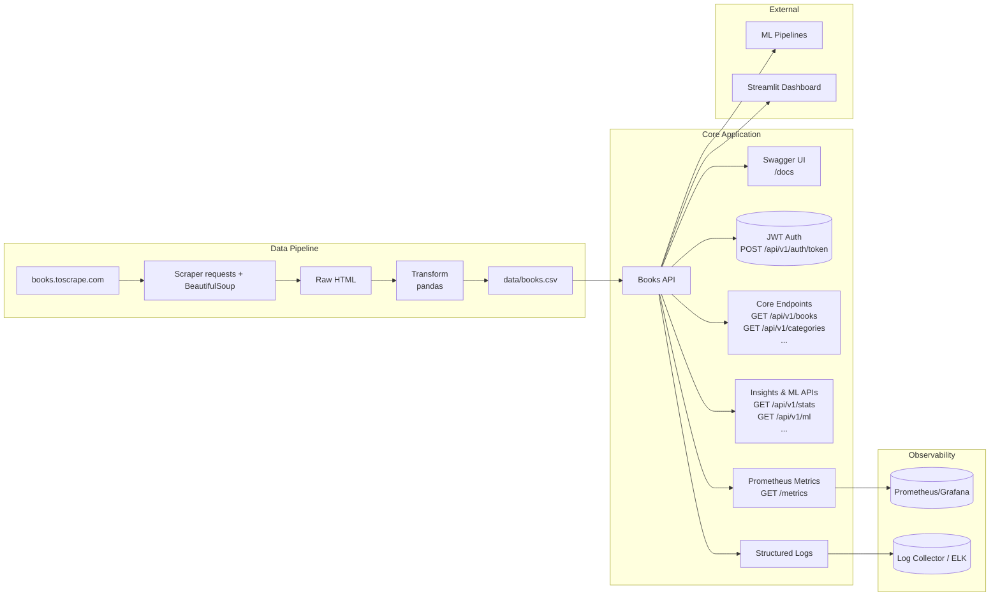

# Tech Challenge — Books API (FastAPI)

API pública para consulta de livros extraídos de [books.toscrape.com](https://books.toscrape.com/).Inclui **web scraping**, **pipeline de dados**, **API REST**, **documentação (Swagger)**, **deploy** e **testes**.

## ⚙️ Arquitetura

```
Scraper (requests + BeautifulSoup)
      ↓
Transform (pandas) → CSV em `data/books.csv`
      ↓
FastAPI (endpoints REST) + Swagger
      ↓
Consumidores (cientistas de dados / serviços)
```



## 📦 Estrutura

```
api/
  main.py
  core/
    security.py
  routes/
    auth.py
    books.py
    categories.py
    stats.py
  models/
    book_model.py
scripts/
  scraper.py
  transform.py
data/
  books.csv         # gerado pelo scraper
tests/
  test_api.py
Procfile
Dockerfile
requirements.txt
README.md
```

## 🚀 Como rodar localmente

```bash
python -m venv .venv
source .venv/bin/activate  # Windows: .venv\Scripts\activate
pip install -r requirements.txt

# Configurar credenciais opcionais (default: admin / secret)
export AUTH_USERNAME=admin
export AUTH_PASSWORD=secret
export JWT_SECRET_KEY=troque-por-uma-chave-secreta

# (1) Rodar scraping (gera data/books.csv)
python scripts/scraper.py

# (2) Subir a API
uvicorn api.main:app --reload
```

Acesse Swagger local: http://127.0.0.1:8000/docs

## 🌐 Deploy (Render)

- Faça push para o GitHub.
- No Render: crie um serviço web apontando para este repo.
- `Procfile` já define: `web: uvicorn api.main:app --host 0.0.0.0 --port $PORT`.
- Deploy Render ativo:
  - API: https://tech-challenge-books-api-rhtc-dashboard.onrender.com
  - Dashboard Streamlit: https://tech-challenge-books-api-rhtc-dashboard.onrender.com

## 📚 Endpoints

- `GET /api/v1/health`
- `POST /api/v1/auth/token`
- `GET /api/v1/books`
- `GET /api/v1/books/{id}`
- `GET /api/v1/books/search?title=&category=`
- `GET /api/v1/categories`
- `GET /api/v1/stats/overview`
- `GET /api/v1/stats/categories`
- `GET /api/v1/books/top-rated`
- `GET /api/v1/books/price-range?min=&max=`
- `GET /api/v1/ml/features`
- `GET /api/v1/ml/training-data`
- `POST /api/v1/ml/predictions`

### Endpoints de Insights

- `GET /api/v1/stats/overview`: estatísticas gerais da coleção (total de livros, preço médio, distribuição de ratings).
- `GET /api/v1/stats/categories`: estatísticas detalhadas por categoria (quantidade de livros, preços por categoria).
- `GET /api/v1/books/top-rated`: lista os livros com melhor avaliação (rating mais alto).
- `GET /api/v1/books/price-range?min={min}&max={max}`: filtra livros dentro de uma faixa de preço específica.

### Endpoints de ML

- `GET /api/v1/ml/features`: entrega features limpas (price, rating, categoria, flag de estoque) prontas para consumo por modelos.
- `GET /api/v1/ml/training-data`: fornece dataset completo com metadados, lista de colunas de features e target sugerido.
- `POST /api/v1/ml/predictions`: endpoint para recebimento de predições; retorna um resumo (quantidade, modelos, score médio).

## 🔐 Autenticação

- Gere um token JWT em `POST /api/v1/auth/token` usando `application/x-www-form-urlencoded`:

```bash
curl -X POST http://127.0.0.1:8000/api/v1/auth/token \
  -H "Content-Type: application/x-www-form-urlencoded" \
  -d "username=admin&password=secret"
```

- Use o token retornado em todas as chamadas (exceto `GET /api/v1/health`) com o cabeçalho:

```
Authorization: Bearer <token>
```

## 🧪 Testes

```bash
pytest -q
```

## 📈 Monitoramento & Analytics

- **Logs estruturados**: toda requisição gera um JSON único no stdout (`event`, `path`, `status_code`, tempo em ms, IP do cliente). Ideal para coletar com ferramentas como Loki/ELK.
- **Métricas Prometheus**: endpoint `/metrics` expõe contadores e histogramas de latência. Basta apontar um Prometheus server para `http://<host>:<port>/metrics`.
- **Dashboard Streamlit**:
  ```bash
  streamlit run dashboard/app.py
  ```
  Autentique-se com usuário/senha da API, visualize overview, ranking de livros, estatísticas por categoria e um snapshot do endpoint `/metrics`.